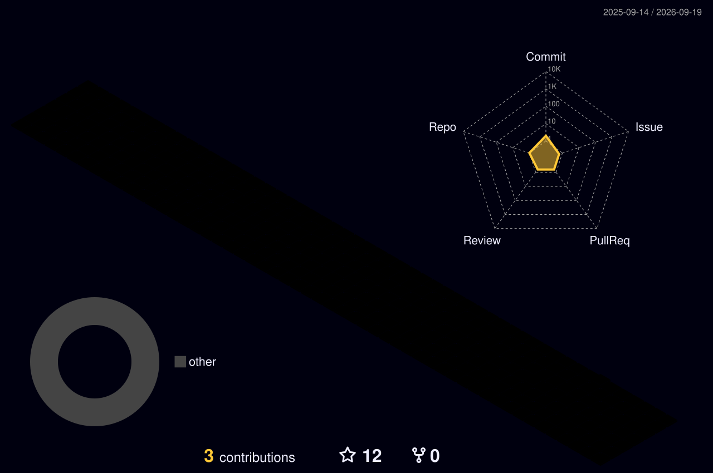

<!-- ═══════════════════ HEADER WAVE ANIMASI ═══════════════════ -->


<!-- ═══════════════════ TYPING ANIMASI ═══════════════════ -->
<div align="center">

[](https://git.io/typing-svg)


</div>

<br/>

<!-- ═══════════════════ ABOUT ═══════════════════ -->
##  About Me

```js
const hafidz = {
  role:      "Frontend Developer",
  code:      ["JavaScript", "Kotlin", "HTML", "CSS"],
  tools:     ["React", "Redux", "Node.js", "Express", "MongoDB", "Tailwind"],
  learning:  "Building better user experiences",
  reachMe:   "hafidzph1@gmail.com"
};
```

- 📫 How to reach me: **hafidzph1@gmail.com**
- 🌱 Currently sharpening my skills in **React & modern web tooling**
- ⚡ Fun fact: I turn coffee into responsive layouts

<br/>

<!-- ═══════════════════ TECH STACK ═══════════════════ -->
## 🛠️ Languages and Tools

<div align="center">


</div>

<br/>

<!-- ═══════════════════ GITHUB STATS ═══════════════════ -->
## 📊 GitHub Stats

<div align="center">


<br/><br/>


<br/><br/>


</div>

<br/>

<!-- ═══════════════════ 3D CONTRIBUTION (auto-generated) ═══════════════════ -->
## 🧊 3D Contribution Calendar

<div align="center">
  
</div>

<br/>

<!-- ═══════════════════ SNAKE ANIMASI (auto-generated) ═══════════════════ -->
## 🐍 Contribution Snake

<div align="center">

<picture>
  <source media="(prefers-color-scheme: dark)" srcset="https://raw.githubusercontent.com/hafidzph/hafidzph/output/github-snake-dark.svg" />
  <source media="(prefers-color-scheme: light)" srcset="https://raw.githubusercontent.com/hafidzph/hafidzph/output/github-snake.svg" />
  
</picture>

</div>

<br/>

<!-- ═══════════════════ TROPHY ═══════════════════ -->
## 🏆 Trophies

<div align="center">
  
</div>

<br/>

<!-- ═══════════════════ CONNECT ═══════════════════ -->
## 🤝 Connect with me

<div align="center">

<a href="https://linkedin.com/in/hafidzph"></a>
<a href="mailto:hafidzph1@gmail.com"></a>

</div>

<!-- ═══════════════════ FOOTER WAVE ═══════════════════ -->

